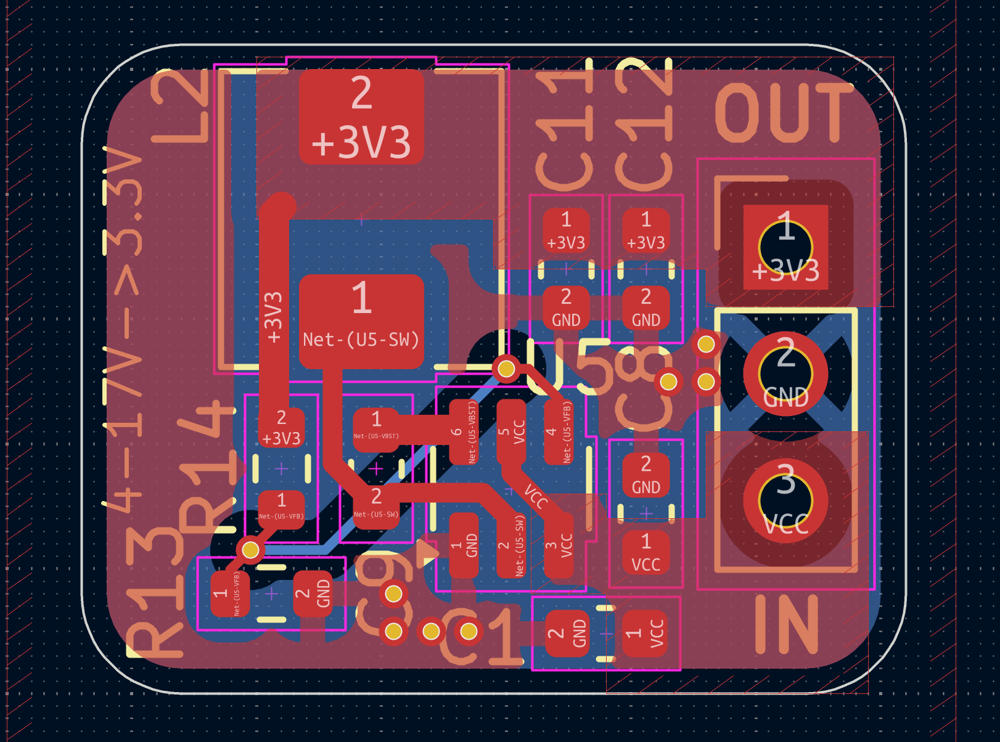
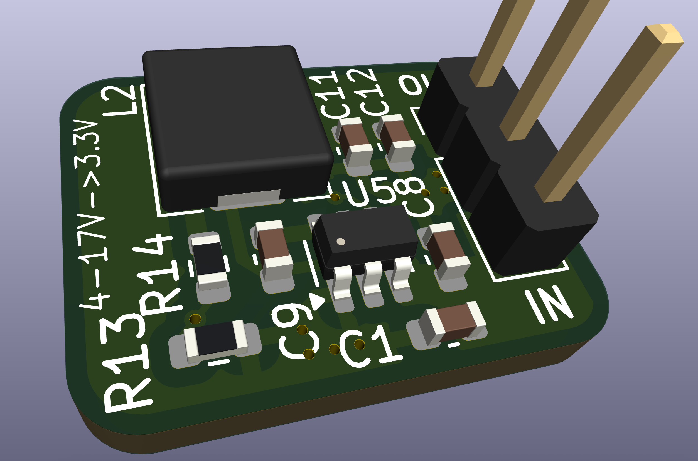
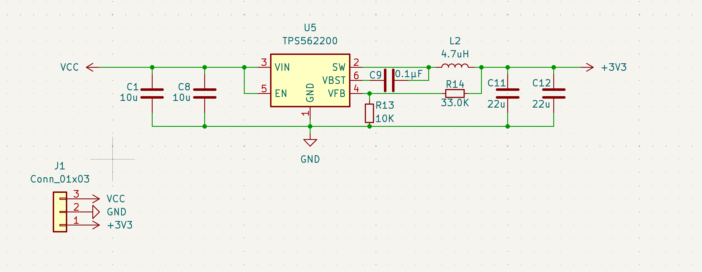

# Step-Down 2A Buck Regulator

## Overview

- Compact synchronous buck converter built around the TI `TPS562200`, delivering a regulated 3.3 V rail at up to 2 A continuous load.
- Intended as a drop-in power stage for embedded projects that need to step 4.5-17 V sources (battery packs, adapters, backplanes) down to logic-level supplies.
- Three-pin interface exposes the regulated output, return, and raw input for easy wiring or header mounting.

## Electrical Data

- **Input voltage:** 4.5-17 V (per `TPS562200` operating range)
- **Nominal output:** 3.3 V (set by the 33 kOhm / 10 kOhm feedback divider)
- **Continuous current:** up to 2 A with adequate airflow and low-loss layout
- **Switching frequency:** 580 kHz (fixed by controller)

### Pinout (`J1`, from silkscreen Pin 1 marker toward Pin 3)

| Pin | Net  | Function                            |
| --- | ---- | ----------------------------------- |
| 1   | +3V3 | Regulated 3.3 V output              |
| 2   | GND  | Power ground / return               |
| 3   | VCC  | Raw input voltage (also feeds `EN`) |

## Repository Contents

- `hardware.kicad_sch`, `hardware.kicad_pcb`: KiCad 8 project files for schematic and board layout.
- `pcb.png`, `3d.png`, `schematic.png`: Quick references for the layout, render, and top-level schematic.

## Assembly Notes

- All passives are 0603 packages.
- `EN` is permanently tied high through the resistor divider, so the regulator starts when `VCC` is present.
- Populate at least one of the 22 uF output capacitors (`C11`, `C12`) for stability; both footprints can be stuffed for additional bulk capacitance.

## Using the Board

1. Solder the three-pin header or wire leads to `J1`.
2. Apply your input source to `VCC`/`GND` and confirm the 3.3 V output on `+3V3`.
3. For different output voltages, adjust the feedback divider (`R14` high-side, `R13` low-side) per the `TPS562200` datasheet (Vout = 0.765 V \* (1 + R14 / R13)).

## License

- Released under the CERN Open Hardware Licence Version 2 - Permissive (`CERN-OHL-P v2`). See `LICENSE` for the full terms and obligations when using the design or producing hardware from it.
